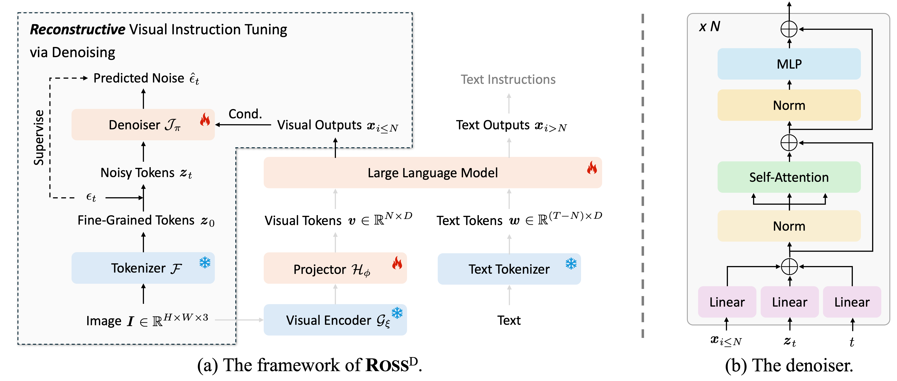

# Ross: Reconstructive Visual Instruction Tuning

[[Project Page](https://haochen-wang409.github.io/ross/)] [[Model Zoo](https://huggingface.co/HaochenWang/ross-qwen2-7b)]

[**Reconstructive Visual Instruction Tuning**](https://arxiv.org/pdf/2410.09575) by
[Haochen Wang](https://haochen-wang409.github.io), 
[Anlin Zheng](https://yexiguafuqihao.github.io/), 
[Yucheng Zhao](https://scholar.google.com/citations?user=QWemjjQAAAAJ&hl=en),
[Tiancai Wang](https://scholar.google.com/citations?user=YI0sRroAAAAJ&hl=en),
[Zheng Ge](https://joker316701882.github.io/),
[Xiangyu Zhang](https://scholar.google.com/citations?user=yuB-cfoAAAAJ&hl=en), and
[Zhaoxiang Zhang](https://scholar.google.com/citations?user=qxWfV6cAAAAJ).

**TL; DR**: We propose reconstructive visual instruction tuning, a vision-centric supervision that enhances fine-grained comprehension capabilities and reduces hallucinations.


> **Abstract.** This paper introduces reconstructive visual instruction tuning (Ross), 
> a family of Large Multimodal Models (LMMs) that exploit *vision-centric supervision signals*. 
> In contrast to conventional visual instruction tuning approaches that exclusively 
> supervise text outputs, Ross prompts LMMs to supervise visual outputs via reconstructing input images.
> By doing so, it capitalizes on the inherent richness and detail present within input images themselves, 
> which are often lost in pure text supervision. 
> However, producing meaningful feedback from natural images is challenging due to the heavy spatial redundancy of visual signals. 
> To address this issue, Ross employs a denoising objective to reconstruct latent representations of input images, 
> avoiding directly regressing exact raw RGB values. 
> This intrinsic activation design inherently encourages LMMs to maintain image detail, 
> thereby enhancing their fine-grained comprehension capabilities and reducing hallucinations. 
> Empirically, Ross consistently brings significant improvements across different visual encoders and language models. 
> In comparison with extrinsic assistance state-of-the-art alternatives that aggregate multiple visual experts, 
> Ross delivers competitive performance with a single SigLIP visual encoder, 
> demonstrating the efficacy of our vision-centric supervision tailored for visual outputs.




## Release

- [2024/xx/xx] 🔥 All codes and checkpoints of Ross have been released. 
- [2024/10/12] 🔥 **Ross** has been released. Checkout the [paper](https://arxiv.org/pdf/2410.09575) for details.


[](https://github.com/tatsu-lab/stanford_alpaca/blob/main/LICENSE)
**Usage and License Notices**: This project utilizes certain datasets and checkpoints that are subject to their respective original licenses. Users must comply with all terms and conditions of these original licenses, including but not limited to the [OpenAI Terms of Use](https://openai.com/policies/terms-of-use) for the dataset and the specific licenses for base language models for checkpoints trained using the dataset (e.g. [Llama community license](https://ai.meta.com/llama/license/) for LLaMA-2 and Vicuna-v1.5). This project does not impose any additional constraints beyond those stipulated in the original licenses. Furthermore, users are reminded to ensure that their use of the dataset and checkpoints is in compliance with all applicable laws and regulations.


## Contents
- [Install](#install)
- [Model Zoo](#model-zoo)
- [Performance](#performance)
- [Train](#train)
- [Evaluation](#evaluation)

## Install

If you are not using Linux, do *NOT* proceed.

1. Clone this repository and navigate to LLaVA folder
```bash
git clone https://github.com/Haochen-Wang409/ross.git
cd ross
```

2. Install Package
```Shell
conda create -n ross python=3.10 -y
conda activate ross
pip install --upgrade pip  # enable PEP 660 support
pip install -e .
```

3. Install additional packages for training cases
```
pip install -e ".[train]"
pip install flash-attn --no-build-isolation
```

### Upgrade to latest code base

```Shell
git pull
pip install -e .

# if you see some import errors when you upgrade,
# please try running the command below (without #)
# pip install flash-attn --no-build-isolation --no-cache-dir
```

## Model Zoo

| Method   | LLM               | Checkpoint |
|----------|-------------------|---:|
| Ross-7B  | Qwen2-7B-Instruct |[HF](https://huggingface.co/HaochenWang/ross-qwen2-7b) | 

## Performance

|                | POPE  | HBench | MMB-EN | MMB-CN | SEED-I | MMMU-V | MMVP  | GQA  | AI2D  |
|----------------|-------|--------|--------|--------|--------|--------|-------|------|-------|
| LLaVA-v1.5-7B  | 86.2  | 47.5   | 65.5   | 58.5   | 66.0   | 34.4   | 20.0  | 62.0 | 55.4  |
| LLaVA-v1.6-7B  | 86.5  | 35.8   | 67.4   | 60.1   | 70.2   | 35.8   | 37.8  | 64.2 | 67.1  |
| Cambrian-1-8B  | 87.4  | 48.7   | 75.9   | 68.9   | 74.7   | 42.7   | 51.3  | 64.6 | 73.0  |
| Ross-7B        | 88.3  | 57.1   | 79.1   | 77.1   | 73.6   | 46.6   | 56.7  | 65.5 | 79.3  |
|                |       |        |        |        |        |        |       |      |       |
| LLaVA-v1.5-13B | 82.5  | 44.9   | 68.8   | 63.6   | 68.2   | 36.6   | 31.9  | 63.3 | 60.8  |
| LLaVA-v1.6-13B | 86.2  | 36.7   | 70.0   | 64.1   | 71.9   | 36.2   | 35.6  | 65.4 | 72.4  |
| Cambrian-1-13B | 85.7  | 54.0   | 75.7   | 65.9   | 74.4   | 40.0   | 41.3  | 64.3 | 73.6  |
| Ross-13B       | 88.7  | 56.4   | 73.6   | 67.4   | 71.1   | 41.3   | 44.7  | 65.2 | 73.8  |

## Train

Ross training consists of two stages: 
(1) feature alignment stage to connect a *frozen vision encoder* to a *frozen LLM*;
(2) instruction tuning stage to teach the model to follow multimodal instructions.

Ross is trained on 8 A100 GPUs with 80GB memory. 
To train on fewer GPUs, you can reduce the `per_device_train_batch_size` and increase the `gradient_accumulation_steps` accordingly. 
Always keep the global batch size the same: `per_device_train_batch_size` x `gradient_accumulation_steps` x `num_gpus`.

### Download VAE checkpoints

Our base model takes the VAE from [FLUX.1-dev](https://huggingface.co/black-forest-labs/FLUX.1-dev) as the fine-grained tokenizer.
Downloading the checkpoint from [this URL](https://huggingface.co/black-forest-labs/FLUX.1-dev/resolve/main/vae/) and put them into ```./pretrained_vae```.

### Pretrain

Training script with DeepSpeed ZeRO-2 can be found in ```scripts/train_ross/pretrain_*.sh```.

- ```--mm_inv_projector_type denoiser_vit3x```: the architecture of the denoiser, containing 3 transformer blocks by default.
- ```--mm_pixel_decoder ./pretrained_vae```: the visual tokenizer.

### Instruction Tuning

Training script with DeepSpeed ZeRO-3 can be found in ```scripts/train_ross/funetune_*.sh```.


## Evaluation

In Ross, we evaluate models on a diverse set of benchmarks using [VLMEvalKit](https://github.com/open-compass/VLMEvalKit) and [lmms-eval](https://github.com/EvolvingLMMs-Lab/lmms-eval). 
The evaluation on [MMVP](https://openaccess.thecvf.com/content/CVPR2024/papers/Tong_Eyes_Wide_Shut_Exploring_the_Visual_Shortcomings_of_Multimodal_LLMs_CVPR_2024_paper.pdf) is implemented based on [Cambrian-1](https://github.com/cambrian-mllm/cambrian/tree/main/eval/eval/mmvp).

See [EVALUATION.md](evaluation/EVALUATION.md) for details.

## Citation

If you find Ross useful for your research and applications, please cite using this BibTeX:
```bibtex
@article{wang2024ross,
  title={Reconstructive visual instruction tuning},
  author={Wang, Haochen and Zheng, Anlin and Zhao, Yucheng and Wang, Tiancai and Ge, Zheng and Zhang, Xiangyu and Zhang, Zhaoxiang},
  journal={arXiv preprint arXiv:2410.09575},
  year={2024}
}
```

## Acknowledgement

- [LLaVA](https://github.com/haotian-liu/LLaVA): the codebase we built upon and the dataset we utilized.
- [Cambrian-1](https://github.com/cambrian-mllm/cambrian): the dataset we utilized.
- [VLMEvalKit](https://github.com/open-compass/VLMEvalKit) and [lmms-eval](https://github.com/EvolvingLMMs-Lab/lmms-eval): the evaluation codebases we built upon.
- [Qwen](https://huggingface.co/Qwen) and [Vicuna](https://github.com/lm-sys/FastChat): the base LLMs we utilized.
